# Go_Stone
2020년도 대구 지방기능경기대회에 때 제작한 프로젝트입니다.
DirectX와 C++17 을 이용해서 개발했습니다.

### 조작키
+ W,S,A,D: 상하좌우로 플레이어 이동
+ Q, E: 무기 교체 
+ F: 공격
+ T: 스킬 1 사용
+ G: 스킬 2 사용
+ F1: 무적
+ F2: 레벨업
+ F3: 아이템 생성
+ F4: 스타트메뉴로 이동
+ F5: 스테이지 1로 이동
+ F6: 스테이지 2로 이동
+ F7: 경험치 요구량 표시

### 플레이 사진
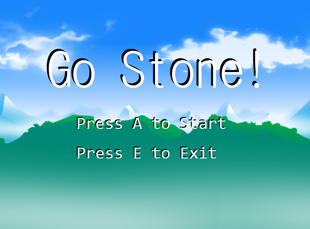
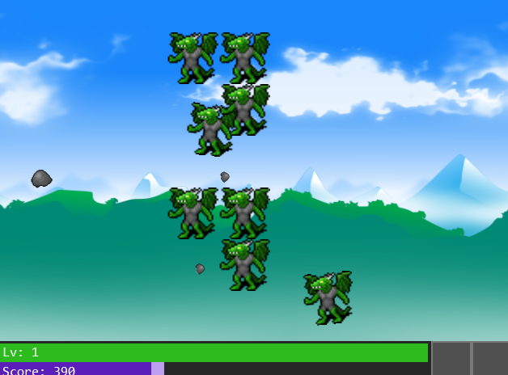
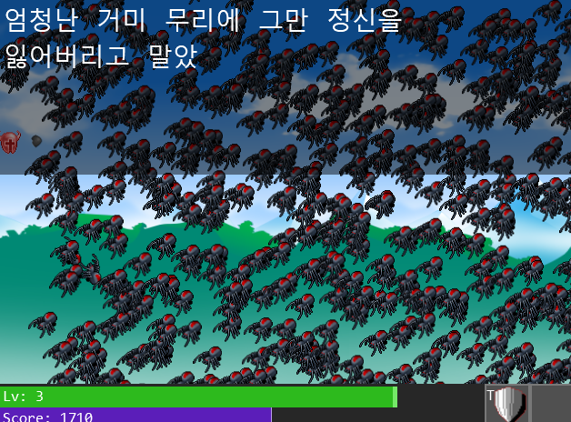
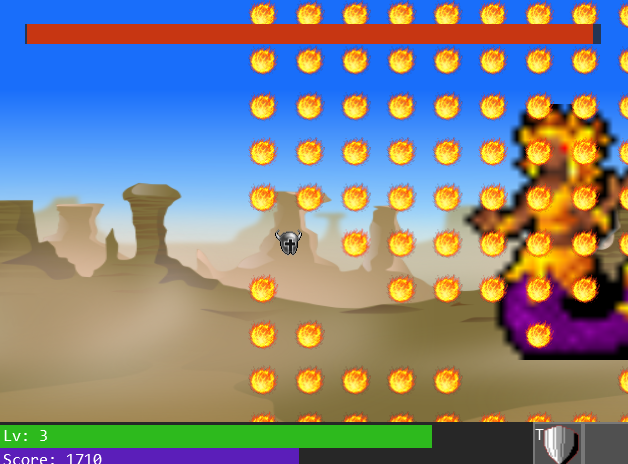
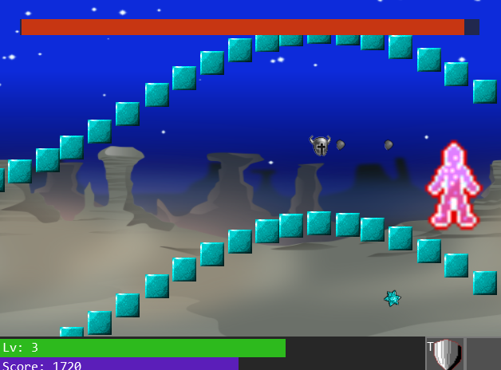
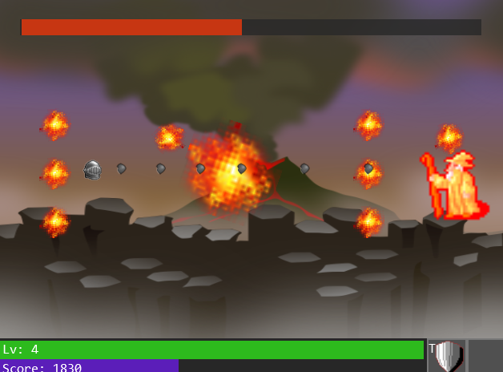
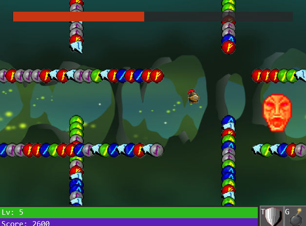
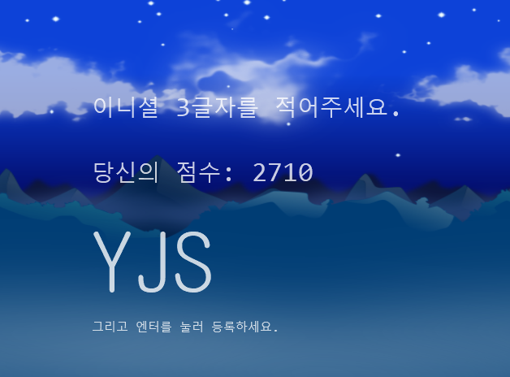
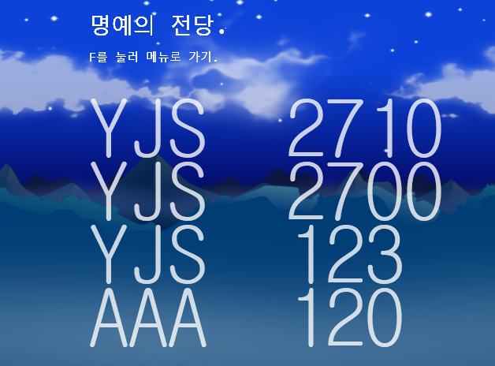
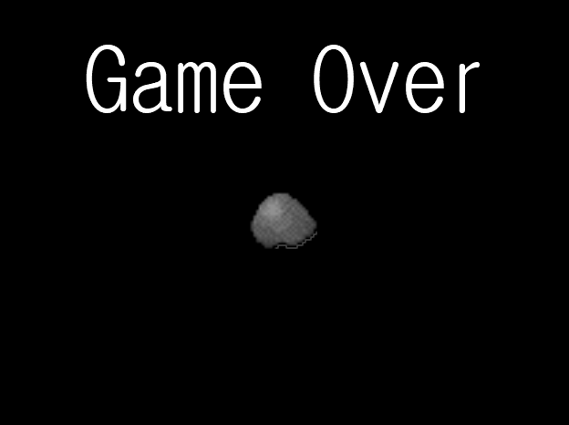
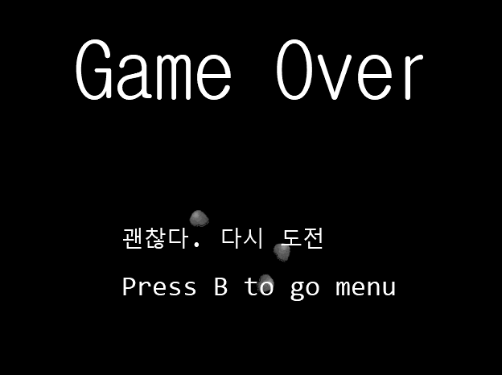